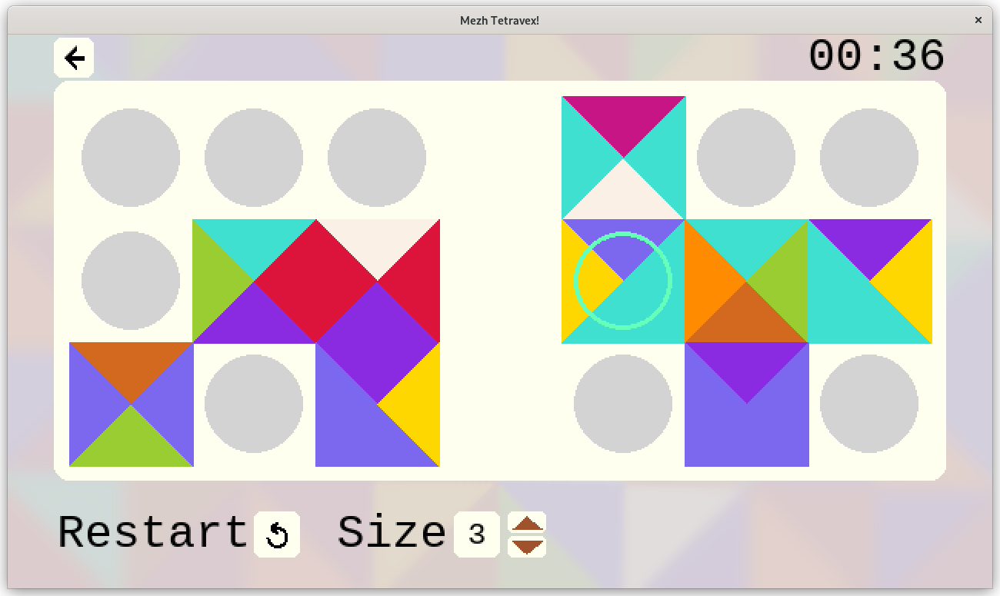

# mezh

`mezh` is my tetravex game project

## What tetravex is

Tetravex is a puzzle game, the goal of the tetravex game is to compose squares with matching colors of the sides.
Read about [tetravex on wikipedia](https://en.wikipedia.org/wiki/Edge-matching_puzzle).
([On russian](https://ru.wikipedia.org/wiki/Тетравекс))

## Preview

